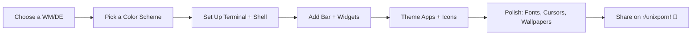

<!-- markdownlint-disable MD033 MD041 -->
<br/>

<div align="center">

  

  # /home/filesdot/resources/lists

  > *Carefully curated list of awesome Linux customization resources*

  [](https://awesome.re)
  [](https://github.com/filesdot/resources)
  [](https://github.com/filesdot/resources/graphs/contributors)
  [](LICENSE)
  [](CONTRIBUTING.md)

  <sup>⭐ If you find this list helpful, please star the repo!</sup>

</div>

<br/>

<p align="center">
  <a href="#-getting-started">🚀 Getting Started</a> •
  <a href="#-quick-start-guide">⚡ Quick Start</a> •
  <a href="#contents">📚 Contents</a> •
  <a href="#-communities--resources">🌐 Communities</a> •
  <a href="CONTRIBUTING.md">🤝 Contribute</a> •
  <a href="code_of_conduct.md">📜 Code of Conduct</a>
</p>

<br/>

---

## 📖 Description

Welcome to the **ultimate** resource for Linux desktop customization - commonly known as *"ricing"* 🍚✨

This curated collection helps you discover tools, themes, and techniques to transform your Linux desktop into a personalized productivity powerhouse. Whether you're a beginner taking your first steps or a veteran ricer seeking inspiration, you'll find:

| Feature | Description |
|---------|-------------|
| 🔍 **Discovery** | Popular tools + hidden gems across all customization categories |
| 🧭 **Guidance** | Beginner-friendly explanations, difficulty ratings, and pro tips |
| 🔗 **Compatibility** | Clear X11/Wayland tags and version notes |
| 🎯 **Curated** | Quality over quantity - only tested, maintained resources |
| 🔄 **Living Document** | Regularly updated with community contributions |

> 💡 **Fun Fact**: "Ricing" originated from car culture ("rice rocket") and was adopted by the Linux community to humorously describe the pursuit of aesthetic perfection in desktop setups. [[3]]

---

## 🚀 Getting Started

<details>
<summary><b>👋 New to Linux Ricing? Start Here!</b></summary>

### What is "Ricing"?
Ricing = extensively customizing your Linux desktop environment for aesthetics, workflow efficiency, or both. Think of it as digital interior design + productivity optimization.

### Recommended Learning Path


### Essential First Steps
1. **Backup your config**: `cp -r ~/.config ~/.config.backup`
2. **Install a package manager**: `pacman`, `apt`, `dnf`, or `nix`
3. **Start small**: Theme your terminal before rewriting your entire WM config
4. **Use dotfiles**: Track configs with Git for easy backup & sharing [[25]]
5. **Join communities**: r/unixporn, Discord servers for help & inspiration [[34-39]]

> ⚠️ **Warning**: Ricing is addictive. You may lose hours tweaking configs instead of working. Proceed with caution. 😉

</details>

---

## ⚡ Quick Start Guide

<details>
<summary><b>🔧 30-Minute Rice Setup (Beginner-Friendly)</b></summary>

### For Arch/Manjaro Users:
```bash
# 1. Install essential tools
sudo pacman -S kitty zsh starship neofetch feh picom polybar

# 2. Clone a starter config (example: simple polybar setup)
git clone https://github.com/adi1090x/polybar-themes ~/.config/polybar

# 3. Set up your shell
sh -c "$(curl -fsSL https://raw.githubusercontent.com/ohmyzsh/ohmyzsh/master/tools/install.sh)"
echo 'starship init zsh | source' >> ~/.zshrc

# 4. Pick a color scheme
git clone https://github.com/catppuccin/kitty ~/.config/kitty/themes/catppuccin

# 5. Set wallpaper & launch
feh --bg-scale ~/wallpapers/your-choice.jpg
exec polybar main &
```

### For Debian/Ubuntu Users:
```bash
# Similar flow with apt:
sudo apt install kitty zsh starship neofetch feh compton polybar
# ... follow same steps above
```

### Pro Tips:
- Use `stow` or `chezmoi` to manage dotfiles cleanly [[24]]
- Test changes in a VM or spare user account first
- Keep a "known-good" config backup for emergencies

</details>

---

## 📚 Contents

<!-- START doctoc generated TOC please keep comment here to allow auto update -->
<!-- DON'T EDIT THIS SECTION, INSTEAD RE-RUN doctoc TO UPDATE -->

- [🪟 Window Managers](#-window-manager)
  - [Stacking](#stacking)
  - [Tiling](#tiling)
  - [Dynamic](#dynamic)
  - [🔑 Quick Reference: WM Keyboard Shortcuts](#-quick-reference-wm-keyboard-shortcuts)
- [🎨 Color Schemes](#-color-schemes)
  - [Utilities](#utilities)
- [🖼️ Wallpapers](#-wallpapers)
  - [Utilities](#utilities-1)
- [🔤 Fonts](#-fonts)
  - [Sans-Serif](#sans-fonts)
  - [Monospace](#monospace-fonts)
  - [Nerd Fonts](#nerd-fonts)
- [📊 Bars & Panels](#-bars--panels)
- [🖱️ Cursors](#-cursors)
- [🎭 Icons](#-icons)
- [🚀 Application Launchers](#-application-launchers)
- [🔔 Notifications](#-notifications)
- [🧩 Widgets](#-widgets)
- [🔒 Session Management](#-session-management)
  - [Logout Menus](#logout-menu)
  - [Screen Lockers](#screen-lock)
- [💻 Terminal Ecosystem](#-terminal-ecosystem)
  - [Emulators](#emulator)
  - [Shells](#shell)
  - [Prompts](#prompt)
  - [Multiplexers](#multiplexer)
  - [CLI Tools](#tools)
  - [✨ Terminal Eye Candy](#fancies)
- [🖥️ GUI Applications](#-gui-applications)
  - [Browsers](#web-browser)
  - [File Managers](#file-manager-1)
  - [Media](#media)
  - [Productivity](#productivity)
  - [Content Creation](#workstation---content-creation)
  - [Gaming](#gaming)
- [🎨 App Theming](#-app-theming)
  - [Firefox](#firefox)
  - [Spotify](#spotify)
  - [Discord](#discord)
  - [VS Code](#vscode)
- [🔐 System Layer](#-system-layer)
  - [Display Managers](#display-manager)
  - [Bootloaders (GRUB)](#grub)
  - [GTK/Qt Theming](#gtkqt-theming)
- [📦 Dotfiles & Config Management](#-dotfiles--config-management) ✨ *NEW*
- [🌐 Communities & Resources](#-communities--resources) ✨ *NEW*
- [🛠️ Troubleshooting](#-troubleshooting) ✨ *NEW*
- [📥 Installation & Configuration](#-installation--configuration)
- [🤝 Contribution](#-contribution)

<!-- END doctoc generated TOC please keep comment here to allow auto update -->

---

## 🪟 Window Manager

<details>
<summary><b>📚 WM Fundamentals</b></summary>

| Term | Definition | Best For |
|------|-----------|----------|
| **Window Manager (WM)** | Controls window placement, decoration, and behavior | Minimalists, keyboard-centric users |
| **Desktop Environment (DE)** | Full suite: WM + file manager + panel + apps + settings | Beginners, users wanting out-of-box experience |
| **Stacking WM** | Windows overlap freely (like Windows/macOS) | Traditional workflow, mouse-heavy use |
| **Tiling WM** | Windows auto-arrange without overlap | Keyboard workflow, multi-tasking efficiency |
| **Dynamic WM** | Switch between tiling/stacking modes | Flexibility seekers |
| **X11** | Legacy display server (mature, compatible) | Nvidia users, legacy app support |
| **Wayland** | Modern display protocol (secure, smooth) | New hardware, future-proofing |

> 💡 **Pro Tip**: Use `loginctl show-session $XDG_SESSION_ID -p Type` to check if you're on X11 or Wayland.

</details>

### Stacking WMs <sub><sup>🖱️ Mouse-Friendly</sup></sub>

| Project | Protocol | Difficulty | Description |
|---------|----------|------------|-------------|
| [GNOME](https://gitlab.gnome.org/GNOME) | X11 + Wayland | ⭐ | Modern, polished DE with extensions ecosystem |
| [KDE Plasma](https://kde.org/) | X11 + Wayland | ⭐⭐ | Highly customizable, feature-rich DE |
| [XFCE](https://www.xfce.org/) | X11 | ⭐ | Lightweight, stable, traditional desktop |
| [Openbox](http://openbox.org/) | X11 | ⭐⭐⭐ | Minimalist WM, highly configurable via XML |

### Tiling WMs <sub><sup>⌨️ Keyboard-Centric</sup></sub>

| Project | Protocol | Difficulty | Highlights |
|---------|----------|------------|------------|
| [bspwm](https://github.com/baskerville/bspwm) | X11 | ⭐⭐⭐ | Binary tree layout, scriptable via shell |
| [i3](https://github.com/i3/i3) | X11 | ⭐⭐ | Simple config, great docs, beginner-friendly tiling |
| [sway](https://github.com/swaywm/sway) | Wayland | ⭐⭐ | i3-compatible, native Wayland support |
| [herbstluftwm](https://github.com/herbstluftwm/herbstluftwm) | X11 | ⭐⭐⭐⭐ | Manual tiling, runtime scripting |
| [leftwm](https://github.com/leftwm/leftwm) | X11 | ⭐⭐⭐ | Rust-based, themable, dynamic workspaces |

### Dynamic WMs <sub><sup>🔄 Best of Both Worlds</sup></sub>

| Project | Protocol | Difficulty | Why Choose It |
|---------|----------|------------|--------------|
| [Hyprland](https://github.com/hyprwm/Hyprland) | Wayland | ⭐⭐⭐ | Animated, GPU-accelerated, vibrant community [[8-16]] |
| [awesome](https://github.com/awesomeWM/awesome) | X11 | ⭐⭐⭐⭐ | Lua-scriptable, widget-ready, highly extensible |
| [QTile](https://github.com/qtile/qtile) | X11 + Wayland | ⭐⭐⭐ | Python-configurable, built-in bar/widgets |
| [XMonad](https://github.com/xmonad/xmonad) | X11 | ⭐⭐⭐⭐⭐ | Haskell-based, rock-solid, infinitely customizable |
| [dwm](https://dwm.suckless.org/) | X11 | ⭐⭐⭐⭐⭐ | Source-patch workflow, minimal, ultra-fast |
| [niri](https://github.com/YaLTeR/niri) | Wayland | ⭐⭐⭐ | Scrollable tiling, PaperWM-inspired, smooth animations |

#### 🔑 Quick Reference: WM Keyboard Shortcuts
<details>
<summary><b>Common Keybindings Cheat Sheet</b></summary>

| Action | i3/Sway | Hyprland | Awesome | bspwm |
|--------|---------|----------|---------|-------|
| Open Terminal | `Mod+Enter` | `Mod+Return` | `Mod+Return` | `Mod+Shift+Enter` |
| Close Window | `Mod+Shift+Q` | `Mod+Shift+Q` | `Mod+Shift+C` | `Mod+Shift+C` |
| Split Layout | `Mod+V/H` | `Mod+V/H` | `Mod+Space` | `bspc node -s @south/north` |
| Toggle Float | `Mod+Shift+Space` | `Mod+Alt+F` | `Mod+Ctrl+Space` | `bspc node -t floating` |
| Workspace 1 | `Mod+1` | `Mod+1` | `Mod+1` | `bspc desktop -f 1` |
| Move Window | `Mod+Shift+1` | `Mod+Shift+1` | `Mod+Shift+1` | `bspc node -d 1` |
| Resize Mode | `Mod+R` | `Mod+R` | `Mod+Ctrl+R` | `bspc node -z left/right 10/0` |

> 💡 Customize these in your WM's config file (usually `~/.config/<wm>/config`).

</details>

---

## 🎨 Color Schemes

<details>
<summary><b>🎨 Color Theory for Ricers</b></summary>

A cohesive color scheme ties your entire desktop together. Key considerations:
- **Contrast**: Ensure readability (WCAG AA minimum for text)
- **Consistency**: Use the same palette across terminal, WM, browser, etc.
- **Mood**: Dark themes reduce eye strain; light themes boost daytime productivity
- **Accent Colors**: Use sparingly for highlights, buttons, and notifications

> 🎯 **Pro Tip**: Use [Coolors](https://coolors.co) or [Huemint](https://huemint.com) to generate accessible palettes.

</details>

### Popular Themes

| Theme | Vibe | Best For | Link |
|-------|------|----------|------|
| [Catppuccin](https://github.com/catppuccin/catppuccin) | 🧁 Soft pastels | All-day comfort, modern aesthetic | [🔗](https://github.com/catppuccin/catppuccin) |
| [Gruvbox](https://github.com/morhetz/gruvbox) | 🍂 Retro warm | Terminal lovers, vintage feel | [🔗](https://github.com/morhetz/gruvbox) |
| [Nord](https://github.com/nordtheme/nord) | ❄️ Arctic blue | Professional, calm focus | [🔗](https://github.com/nordtheme/nord) |
| [Everforest](https://github.com/sainnhe/everforest) | 🌲 Natural green | Nature-inspired, easy on eyes | [🔗](https://github.com/sainnhe/everforest) |
| [Tokyo Night](https://github.com/enkia/tokyo-night) | 🌃 Neon urban | Modern, vibrant, high contrast | [🔗](https://github.com/enkia/tokyo-night) |
| [Dracula](https://github.com/dracula/dracula-theme) | 🧛 Dark playful | Fun, high-contrast, widely supported | [🔗](https://github.com/dracula/dracula-theme) |
| [Rose Pine](https://github.com/rose-pine/rose-pine-theme) | 🌹 Elegant minimal | Sophisticated, soft contrast | [🔗](https://github.com/rose-pine/rose-pine-theme) |

### Utilities

| Tool | Purpose | Protocol | Notes |
|------|---------|----------|-------|
| [pywal](https://github.com/dylanaraps/pywal) | Auto-generate themes from wallpapers | X11 + Wayland | Integrates with 50+ apps |
| [wpgtk](https://github.com/deviantfero/wpgtk) | Theme/wallpaper manager with GUI | X11 + Wayland | Template system for bulk theming |
| [Paletty](https://paletty.dev) | Browser-based palette generator | Web | Export to Kitty, Alacritty, Ghostty, etc. |

---

## 🖼️ Wallpapers

### Curated Collections
| Creator | Style | Theme | Link |
|---------|-------|-------|------|
| [dharmx/walls](https://github.com/dharmx/walls) | 🎨 Diverse aesthetic | Mixed | [🔗](https://github.com/dharmx/walls) |
| [linuxdotexe/nordic-wallpapers](https://github.com/linuxdotexe/nordic-wallpapers) | ❄️ Nord palette | Nord | [🔗](https://github.com/linuxdotexe/nordic-wallpapers) |
| [zhichaoh/catppuccin-wallpapers](https://github.com/zhichaoh/catppuccin-wallpapers) | 🧁 Catppuccin | Catppuccin | [🔗](https://github.com/zhichaoh/catppuccin-wallpapers) |
| [Apeiros-46B/everforest-walls](https://github.com/Apeiros-46B/everforest-walls) | 🌲 Everforest | Everforest | [🔗](https://github.com/Apeiros-46B/everforest-walls) |

### Wallpaper Utilities
| Tool | Protocol | Features |
|------|----------|----------|
| [hyprpaper](https://github.com/hyprwm/hyprpaper) | Wayland | Fast, IPC-controlled, multi-monitor |
| [swaybg](https://github.com/swaywm/swaybg) | Wayland | Simple, reliable, wlroots-compatible |
| [mpvpaper](https://github.com/GhostNaN/mpvpaper) | Wayland | Animated/video wallpapers via mpv |
| [awww](https://codeberg.org/LGFae/awww) | Wayland | Animated wallpapers with runtime control |
| [feh](https://github.com/derf/feh) | X11 | Lightweight, scriptable, slideshow mode |

> 💡 **Pro Tip**: Use `pywal` + `wal-restore` to auto-apply color schemes when wallpaper changes.

---

## 🔤 Fonts

<details>
<summary><b>🔤 Font Fundamentals</b></summary>

| Type | Use Case | Examples |
|------|----------|----------|
| **Sans-Serif** | UI text, headings, general readability | Roboto, Inter, Google Sans |
| **Monospace** | Terminals, code editors, aligned output | JetBrains Mono, Fira Code, Iosevka |
| **Nerd Fonts** | Icons in terminal/status bars | Any font + [Nerd Fonts patcher](https://www.nerdfonts.com) |

**Ligatures**: Combined glyphs (e.g., `=>`, `!=`) that improve code readability. Enable in your terminal/editor if supported.

</details>

### Sans-Serif Fonts
| Font | Ligatures | Best For | Link |
|------|-----------|----------|------|
| [Google Sans](https://font.download/font/google-sans) | ✅ | Modern UI, clean headings | [🔗](https://font.download/font/google-sans) |
| [Inter](https://rsms.me/inter/) | ❌ | UI text, excellent readability | [🔗](https://rsms.me/inter/) |
| [Roboto](https://fonts.google.com/specimen/Roboto) | ❌ | Android-style, versatile | [🔗](https://fonts.google.com/specimen/Roboto) |

### Monospace Fonts (Coding/Terminal)
| Font | Ligatures | Notable Feature | Link |
|------|-----------|----------------|------|
| [JetBrains Mono](https://github.com/JetBrains/JetBrainsMono) | ✅ | Designed for developers, great italics | [🔗](https://github.com/JetBrains/JetBrainsMono) |
| [Fira Code](https://github.com/tonsky/FiraCode) | ✅ | First popular ligature font | [🔗](https://github.com/tonsky/FiraCode) |
| [Cascadia Code](https://github.com/microsoft/cascadia-code) | ✅ | Microsoft's modern terminal font | [🔗](https://github.com/microsoft/cascadia-code) |
| [Iosevka](https://github.com/be5invis/Iosevka) | ✅ | Highly customizable build system | [🔗](https://github.com/be5invis/Iosevka) |

### Nerd Fonts
> 🔧 **Setup Tip**: Install via [getnf](https://github.com/getnf/getnf) or patch your own with [font-patcher](https://github.com/ryanoasis/nerd-fonts#font-patcher).

```bash
# Example: Install JetBrainsMono Nerd Font
getnf install JetBrainsMono
# Then set in terminal config:
# font_family = "JetBrainsMono Nerd Font"
```

| Resource | Purpose | Link |
|----------|---------|------|
| [Nerd Fonts](https://github.com/ryanoasis/nerd-fonts) | 50+ patched fonts | [🔗](https://github.com/ryanoasis/nerd-fonts) |
| [getnf](https://github.com/getnf/getnf) | Easy CLI installer | [🔗](https://github.com/getnf/getnf) |
| [font-patcher](https://github.com/ryanoasis/nerd-fonts#font-patcher) | Patch custom fonts | [🔗](https://github.com/ryanoasis/nerd-fonts) |

---

## 📊 Bars & Panels

| Tool | Protocol | Language | Highlights |
|------|----------|----------|------------|
| [Waybar](https://github.com/Alexays/Waybar) | Wayland | C++/JSON | Highly modular, CSS-styled, active development |
| [Polybar](https://github.com/polybar/polybar) | X11 | C++/INI | Mature, scriptable, huge community |
| [Eww](https://github.com/elkowar/eww) | X11 + Wayland | Rust/YAML | Widget-focused, reactive UI, animations |
| [AGS](https://github.com/Aylur/ags) | X11 + Wayland | JS/TS | GNOME Shell-like, extensible, modern |
| [Quickshell](https://quickshell.org/) | X11 + Wayland | QML/Qt | QtQuick-based, smooth animations |

> 💡 **Pro Tip**: Use `exec-once = waybar` in your WM config to auto-start your bar.

---

## 🖱️ Cursors

| Cursor Set | Style | Link |
|------------|-------|------|
| [Bibata](https://github.com/ful1e5/Bibata_Cursor) | Material Design, smooth | [🔗](https://github.com/ful1e5/Bibata_Cursor) |
| [Capitaine](https://github.com/keeferrourke/capitaine-cursors) | KDE Plasma, clean | [🔗](https://github.com/keeferrourke/capitaine-cursors) |
| [Qogir](https://github.com/vinceliuice/Qogir-icon-theme) | Flat, colorful | [🔗](https://github.com/vinceliuice/Qogir-icon-theme) |
| [Phinger](https://github.com/phingerin/phinger-cursors) | Simple, scalable | [🔗](https://github.com/phingerin/phinger-cursors) |

### Utilities
| Tool | Purpose | Protocol |
|------|---------|----------|
| [hyprcursor](https://github.com/hyprwm/hyprcursor) | Modern cursor format for Hyprland | Wayland |
| [update-cursor-theme](https://wiki.archlinux.org/title/Cursor_themes) | System-wide cursor setup | X11 + Wayland |

---

## 🎭 Icons

| Icon Theme | Style | Best For | Link |
|------------|-------|----------|------|
| [Papirus](https://github.com/PapirusDevelopmentTeam/papirus-icon-theme) | Pixel-perfect, extensive | General use, GTK apps | [🔗](https://github.com/PapirusDevelopmentTeam/papirus-icon-theme) |
| [Tela](https://github.com/vinceliuice/Tela-icon-theme) | Flat, vibrant | Modern desktops | [🔗](https://github.com/vinceliuice/Tela-icon-theme) |
| [Colloid](https://github.com/vinceliuice/Colloid-icon-theme) | Playful, colorful | Fun, expressive setups | [🔗](https://github.com/vinceliuice/Colloid-icon-theme) |
| [Candy Icons](https://github.com/EliverLara/candy-icons) | Gradient, glossy | Eye-catching aesthetics | [🔗](https://github.com/EliverLara/candy-icons) |

> 🔧 **Apply Icons**: `gsettings set org.gnome.desktop.interface icon-theme 'Tela-circle'` (GTK) or edit `~/.config/qt5ct/qt5ct.conf` (Qt).

---

## 🚀 Application Launchers

| Tool | Protocol | Highlights | Link |
|------|----------|------------|------|
| [Rofi](https://github.com/davatorium/rofi) | X11 + [Wayland fork](https://github.com/lbonn/rofi) | Scriptable, themed, multi-mode | [🔗](https://github.com/davatorium/rofi) |
| [wofi](https://gitlab.com/dgirault/wofi) | Wayland | Simple, wlroots-native, CSS-styled | [🔗](https://gitlab.com/dgirault/wofi) |
| [tofi](https://github.com/philj56/tofi) | Wayland | Minimal, fast, config-light | [🔗](https://github.com/philj56/tofi) |
| [Anyrun](https://github.com/Kirottu/anyrun) | Wayland | Modular plugins, modern UI | [🔗](https://github.com/Kirottu/anyrun) |
| [Ulauncher](https://github.com/Ulauncher/Ulauncher) | X11 + Wayland | Extensions, web search, workflows | [🔗](https://github.com/Ulauncher/Ulauncher) |

### Rofi Theme Collections
- [adi1090x/rofi](https://github.com/adi1090x/rofi) - 100+ curated themes & applets
- [indrajitk/rofi-themes](https://github.com/indrajitk/rofi-themes) - Minimal, modern designs

---

## 🔔 Notifications

| Daemon | Protocol | Features | Link |
|--------|----------|----------|------|
| [Dunst](https://github.com/dunst-project/dunst) | X11 + Wayland | Lightweight, scriptable, themable | [🔗](https://github.com/dunst-project/dunst) |
| [Mako](https://github.com/emersion/mako) | Wayland | Simple, wlroots-native, config-light | [🔗](https://github.com/emersion/mako) |
| [SwayNC](https://github.com/ErikReider/SwayNotificationCenter) | Wayland | Control center, widgets, GTK UI | [🔗](https://github.com/ErikReider/SwayNotificationCenter) |

> 💡 **Pro Tip**: Use `dunstify` or `notify-send` to test notifications during config.

---

## 🧩 Widgets

| Widget | Purpose | Protocol | Link |
|--------|---------|----------|------|
| [Conky](https://github.com/brndnmtthws/conky) | System monitor, desktop widgets | X11 | [🔗](https://github.com/brndnmtthws/conky) |
| [GLava](https://github.com/jarcode-foss/glava) | OpenGL audio visualizer | X11 + Wayland | [🔗](https://github.com/jarcode-foss/glava) |
| [Kando](https://github.com/kando-menu/kando) | Cross-platform pie menu | X11 + Wayland | [🔗](https://github.com/kando-menu/kando) |
| [Eww Widgets](https://github.com/elkowar/eww) | Custom reactive widgets | X11 + Wayland | [🔗](https://github.com/elkowar/eww) |

---

## 🔒 Session Management

### Logout Menus
| Tool | Protocol | Description | Link |
|------|----------|-------------|------|
| [wlogout](https://github.com/ArtsyMacaw/wlogout) | Wayland | Simple, themed, icon-based menu | [🔗](https://github.com/ArtsyMacaw/wlogout) |
| [rofi-power-menu](https://github.com/adi1090x/rofi/tree/master/powermenu) | X11 + Wayland | Rofi-based, highly customizable | [🔗](https://github.com/adi1090x/rofi) |

### Screen Lockers
| Tool | Protocol | Features | Link |
|------|----------|----------|------|
| [hyprlock](https://github.com/hyprwm/hyprlock) | Wayland | GPU-accelerated, animated, Hyprland-native | [🔗](https://github.com/hyprwm/hyprlock) |
| [swaylock](https://github.com/swaywm/swaylock) | Wayland | Simple, secure, wlroots-compatible | [🔗](https://github.com/swaywm/swaylock) |
| [i3lock](https://github.com/i3/i3lock) | X11 | Minimal, scriptable, widely supported | [🔗](https://github.com/i3/i3lock) |
| [swaylock-effects](https://github.com/mortie/swaylock-effects) | Wayland | swaylock + blur, pixelate, fade effects | [🔗](https://github.com/mortie/swaylock-effects) |

---

## 💻 Terminal Ecosystem

### Emulators
| Terminal | Protocol | Highlights | Link |
|----------|----------|------------|------|
| [kitty](https://github.com/kovidgoyal/kitty) | X11 + Wayland | GPU-rendered, tabs, ligatures, scriptable | [🔗](https://github.com/kovidgoyal/kitty) |
| [alacritty](https://github.com/alacritty/alacritty) | X11 + Wayland | Fastest, minimal config, cross-platform | [🔗](https://github.com/alacritty/alacritty) |
| [ghostty](https://github.com/ghostty-org/ghostty) | X11 + Wayland | Modern, GPU-accelerated, macOS-native feel | [🔗](https://github.com/ghostty-org/ghostty) |
| [wezterm](https://github.com/wez/wezterm) | X11 + Wayland | Multiplexer built-in, Lua config, tabs/panes | [🔗](https://github.com/wez/wezterm) |
| [foot](https://codeberg.org/dnkl/foot) | Wayland | Lightweight, wlroots-native, fast startup | [🔗](https://codeberg.org/dnkl/foot) |

### Shells
| Shell | Strengths | Config Frameworks | Link |
|-------|-----------|------------------|------|
| [bash](https://www.gnu.org/software/bash/) | Universal, POSIX-compliant | [ble.sh](https://github.com/akinomyoga/ble.sh) | [🔗](https://www.gnu.org/software/bash/) |
| [zsh](https://zsh.sourceforge.io/) | Powerful, plugin-rich | [Oh My Zsh](https://ohmyz.sh), [Prezto](https://github.com/sorin-ionescu/prezto), [Zim](https://github.com/zimfw/zimfw) | [🔗](https://zsh.sourceforge.io/) |
| [fish](https://fishshell.com/) | User-friendly, autosuggestions | [Oh My Fish](https://github.com/oh-my-fish/oh-my-fish) | [🔗](https://fishshell.com/) |
| [nushell](https://github.com/nushell/nushell) | Structured data, modern | Built-in | [🔗](https://github.com/nushell/nushell) |

### Prompts
| Prompt | Shell | Features | Link |
|--------|-------|----------|------|
| [Starship](https://starship.rs) | Any | Blazing fast, cross-shell, auto-config | [🔗](https://starship.rs) |
| [Powerlevel10k](https://github.com/romkatv/powerlevel10k) | zsh | Instant prompt, rich icons, wizard setup | [🔗](https://github.com/romkatv/powerlevel10k) |
| [oh-my-posh](https://ohmyposh.dev) | Any | Cross-platform, JSON themes, Nerd Font icons | [🔗](https://ohmyposh.dev) |

### Multiplexers
| Tool | Highlights | Best For | Link |
|------|------------|----------|------|
| [tmux](https://github.com/tmux/tmux) | Mature, scriptable, huge plugin ecosystem | Remote work, persistent sessions | [🔗](https://github.com/tmux/tmux) |
| [zellij](https://zellij.dev) | Rust-based, layouts, pane sync | Modern workflows, beginners | [🔗](https://zellij.dev) |
| [byobu](https://byobu.org) | tmux/screen wrapper, Ubuntu-friendly | Sysadmins, quick setup | [🔗](https://byobu.org) |

### CLI Tools
#### File Managers
| Tool | Language | Highlights | Link |
|------|----------|------------|------|
| [yazi](https://github.com/sxyazi/yazi) | Rust | Blazing fast, async, preview, vim-like | [🔗](https://github.com/sxyazi/yazi) |
| [ranger](https://github.com/ranger/ranger) | Python | Vim-like, extensible, preview support | [🔗](https://github.com/ranger/ranger) |
| [superfile](https://github.com/yorukot/superfile) | Go | Modern UI, tabs, preview, themable | [🔗](https://github.com/yorukot/superfile) |
| [nnn](https://github.com/jarun/nnn) | C | Tiny, fast, plugin system, low memory | [🔗](https://github.com/jarun/nnn) |

#### Editors
| Editor | Type | Highlights | Link |
|--------|------|------------|------|
| [Neovim](https://neovim.io) | Modal | Extensible, LSP-ready, Lua config | [🔗](https://github.com/neovim/neovim) |
| [Helix](https://helix-editor.com) | Modal | Built-in LSP, multiple selections, Rust | [🔗](https://github.com/helix-editor/helix) |
| [micro](https://micro-editor.github.io) | Modeless | Intuitive, mouse support, plugin system | [🔗](https://github.com/zyedidia/micro) |

#### System Monitoring
| Tool | Features | Link |
|------|----------|------|
| [btop](https://github.com/aristocratos/btop) | Beautiful UI, mouse support, themes | [🔗](https://github.com/aristocratos/btop) |
| [htop](https://htop.dev) | Interactive, tree view, search | [🔗](https://github.com/htop-dev/htop) |
| [bottom](https://github.com/ClementTsang/bottom) | Cross-platform, customizable widgets | [🔗](https://github.com/ClementTsang/bottom) |

#### Directory Listing
| Tool | Highlights | Link |
|------|------------|------|
| [eza](https://eza.rocks) | Modern `ls`, icons, git status, tree view | [🔗](https://github.com/eza-community/eza) |
| [lsd](https://github.com/Peltoche/lsd) | Icons, colors, tree mode, git integration | [🔗](https://github.com/Peltoche/lsd) |

### ✨ Terminal Eye Candy
#### Fetch Tools
| Tool | Language | Highlights | Link |
|------|----------|------------|------|
| [fastfetch](https://github.com/fastfetch-cli/fastfetch) | C | Blazing fast, modular, 50+ modules | [🔗](https://github.com/fastfetch-cli/fastfetch) |
| [neofetch](https://github.com/dylanaraps/neofetch) | Bash | Classic, widely themed, simple | [🔗](https://github.com/dylanaraps/neofetch) |
| [macchina](https://github.com/Macchina-CLI/macchina) | Rust | Fast, minimal, themable, extensible | [🔗](https://github.com/Macchina-CLI/macchina) |

#### Visualizers & Fun
| Tool | Purpose | Link |
|------|---------|------|
| [CAVA](https://github.com/karlstav/cava) | Terminal audio visualizer | [🔗](https://github.com/karlstav/cava) |
| [pipes.sh](https://github.com/pipeseroni/pipes.sh) | Animated pipes screensaver | [🔗](https://github.com/pipeseroni/pipes.sh) |
| [cbonsai](https://gitlab.com/jallbrit/cbonsai) | Grow bonsai trees in-terminal | [🔗](https://gitlab.com/jallbrit/cbonsai) |
| [CMatrix](https://github.com/abishekvashok/cmatrix) | Matrix digital rain effect | [🔗](https://github.com/abishekvashok/cmatrix) |
| [pokemon-colorscripts](https://gitlab.com/phoneybadger/pokemon-colorscripts) | Pokémon sprites in terminal | [🔗](https://gitlab.com/phoneybadger/pokemon-colorscripts) |

---

## 🖥️ GUI Applications

### Web Browsers
| Browser | Engine | Privacy Focus | Ricing Potential | Link |
|---------|--------|--------------|-----------------|------|
| [Firefox](https://firefox.com) | Gecko | 🔒🔒🔒 | ⭐⭐⭐⭐⭐ (userChrome.css) | [🔗](https://firefox.com) |
| [Floorp](https://floorp.app) | Gecko | 🔒🔒🔒 | ⭐⭐⭐⭐⭐ (Firefox-based + extras) | [🔗](https://floorp.app) |
| [Thorium](https://github.com/Alex313031/Thorium) | Chromium | 🔒🔒 | ⭐⭐⭐⭐ (Chromium + patches) | [🔗](https://github.com/Alex313031/Thorium) |
| [Brave](https://brave.com) | Chromium | 🔒🔒🔒 | ⭐⭐⭐ (limited CSS theming) | [🔗](https://brave.com) |

### File Managers (GUI)
| App | Desktop | Highlights | Link |
|-----|---------|------------|------|
| [Yazi](https://yazi-rs.github.io) | Terminal-first | Blazing fast, async, preview | [🔗](https://github.com/sxyazi/yazi) |
| [Double Commander](https://doublecmd.sourceforge.io) | Cross-platform | Dual-pane, plugin system | [🔗](https://doublecmd.sourceforge.io) |
| [Nautilus](https://gitlab.gnome.org/GNOME/nautilus) | GNOME | Clean, extensions, search | [🔗](https://gitlab.gnome.org/GNOME/nautilus) |
| [Dolphin](https://kde.org/applications/system/org.kde.dolphin) | KDE | Powerful, split view, plugins | [🔗](https://kde.org/applications/system/org.kde.dolphin) |

### Media
| Category | App | Highlights | Link |
|----------|-----|------------|------|
| **Music** | [Amberol](https://gitlab.gnome.org/World/amberol) | Minimal, GTK4, adaptive UI | [🔗](https://gitlab.gnome.org/World/amberol) |
| **Music** | [Feishin](https://feishin.app) | Modern, self-hosted, Jellyfin/Navidrome | [🔗](https://github.com/jeffvli/feishin) |
| **Video** | [mpv](https://mpv.io) | Minimal, scriptable, high-quality | [🔗](https://github.com/mpv-player/mpv) |
| **Images** | [imv](https://git.sr.ht/~exec64/imv) | Fast, tiling-WM friendly, keyboard-driven | [🔗](https://git.sr.ht/~exec64/imv) |

### Productivity
| App | Type | Highlights | Link |
|-----|------|------------|------|
| [Obsidian](https://obsidian.md) | Notes | Markdown, graph view, plugins | [🔗](https://obsidian.md) |
| [AppFlowy](https://appflowy.io) | Workspace | Open-source Notion alternative | [🔗](https://github.com/AppFlowy-IO/AppFlowy) |
| [qnote](https://github.com/Omibranch/qnote) | Notes | Minimal, Markdown, PDF export, Tauri | [🔗](https://github.com/Omibranch/qnote) |

### Content Creation
#### Image Editing
| App | Type | Highlights | Link |
|-----|------|------------|------|
| [Krita](https://krita.org) | Painting | Professional, brush engines, animation | [🔗](https://github.com/KDE/krita) |
| [GIMP](https://www.gimp.org) | Photo Editing | Powerful, plugin ecosystem, scriptable | [🔗](https://gitlab.gnome.org/GNOME/gimp) |
| [Inkscape](https://inkscape.org) | Vector | SVG-native, extensions, cross-platform | [🔗](https://gitlab.com/inkscape/inkscape) |

#### Video/Audio
| App | Type | Highlights | Link |
|-----|------|------------|------|
| [Kdenlive](https://kdenlive.org) | Video Editing | Multi-track, effects, proxy editing | [🔗](https://github.com/KDE/kdenlive) |
| [OBS Studio](https://obsproject.com) | Streaming/Recording | Plugins, scenes, cross-platform | [🔗](https://github.com/obsproject/obs-studio) |
| [Ardour](https://ardour.org) | DAW | Professional audio, mixing, routing | [🔗](https://ardour.org) |

#### 3D & CAD
| App | Type | Highlights | Link |
|-----|------|------------|------|
| [Blender](https://blender.org) | 3D Suite | Modeling, animation, rendering, VFX | [🔗](https://github.com/blender/blender) |
| [FreeCAD](https://freecad.org) | Parametric CAD | Engineering, BIM, Python scripting | [🔗](https://github.com/FreeCAD/FreeCAD) |

### Gaming
| Launcher | Platform | Highlights | Link |
|----------|----------|------------|------|
| [Steam](https://store.steampowered.com) | Multi | Proton, Big Picture, cloud saves | [🔗](https://store.steampowered.com) |
| [Heroic](https://heroicgameslauncher.com) | Epic/GOG | Native Linux, Wine/Proton support | [🔗](https://github.com/Heroic-Games-Launcher/HeroicGamesLauncher) |
| [Lutris](https://lutris.net) | Multi | Unified library, installer scripts | [🔗](https://github.com/lutris/lutris) |

> 🎮 **Pro Tip**: Join [r/linux_gaming](https://reddit.com/r/linux_gaming) for ProtonDB tips, Wine configs, and performance tweaks.

---

## 🎨 App Theming

### Firefox
#### Themes
| Theme | Style | Link |
|-------|-------|------|
| [Sweet Firefox](https://github.com/EliverLara/firefox-sweet-theme) | Dark, vibrant | [🔗](https://github.com/EliverLara/firefox-sweet-theme) |
| [ShyFox](https://github.com/Naezr/ShyFox) | Auto-hiding UI | [🔗](https://github.com/Naezr/ShyFox) |
| [SimpleFox](https://github.com/migueravila/SimpleFox) | Minimal, keyboard-centric | [🔗](https://github.com/migueravila/SimpleFox) |

#### Startpages
| Startpage | Features | Link |
|-----------|----------|------|
| [nightTab](https://github.com/zombieFox/nightTab) | Customizable, color accents, widgets | [🔗](https://github.com/zombieFox/nightTab) |
| [Excalith](https://github.com/excalith/excalith-start-page) | Terminal-inspired, search, bookmarks | [🔗](https://github.com/excalith/excalith-start-page) |
| [Bento Next](https://github.com/lewisdoesstuff/bento-next) | Vue 3, Tailwind, widgets | [🔗](https://github.com/lewisdoesstuff/bento-next) |

### Spotify
| Tool | Purpose | Link |
|------|---------|------|
| [Spicetify](https://spicetify.app) | CLI theming engine | [🔗](https://github.com/spicetify/spicetify-cli) |
| [Catppuccin for Spotify](https://github.com/catppuccin/spicetify) | Pastel theme | [🔗](https://github.com/catppuccin/spicetify) |
| [Bloom](https://github.com/nimsandu/spicetify-bloom) | Dynamic, animated | [🔗](https://github.com/nimsandu/spicetify-bloom) |

### Discord
| Mod | Highlights | Link |
|-----|------------|------|
| [Vencord](https://vencord.dev) | Lightweight, plugin system, active dev | [🔗](https://github.com/Vendicated/Vencord) |
| [BetterDiscord](https://betterdiscord.app) | Mature, huge theme/plugin library | [🔗](https://github.com/BetterDiscord/BetterDiscord) |

### VS Code / VSCodium
| Theme | Style | Link |
|-------|-------|------|
| [Tokyo Night](https://marketplace.visualstudio.com/items?itemName=enkia.tokyo-night) | Dark, neon accents | [🔗](https://github.com/enkia/tokyo-night-vscode-theme) |
| [Catppuccin](https://marketplace.visualstudio.com/items?itemName=Catppuccin.catppuccin-vsc) | Soft pastels | [🔗](https://github.com/catppuccin/vscode) |
| [Material Theme](https://marketplace.visualstudio.com/items?itemName=Equinusocio.vsc-material-theme) | Google Material Design | [🔗](https://github.com/material-theme/vsc-material-theme) |

---

## 🔐 System Layer

### Display Managers
| DM | Protocol | Highlights | Link |
|----|----------|------------|------|
| [SDDM](https://github.com/sddm/sddm) | X11 + Wayland | QML-themable, KDE-native | [🔗](https://github.com/sddm/sddm) |
| [Ly](https://github.com/fairyglade/ly) | TUI | Console-based, minimal, fast | [🔗](https://github.com/fairyglade/ly) |
| [GDM](https://gitlab.gnome.org/GNOME/gdm) | X11 + Wayland | GNOME-integrated, secure | [🔗](https://gitlab.gnome.org/GNOME/gdm) |

#### SDDM Themes
| Theme | Style | Link |
|-------|-------|------|
| [Sugar Dark](https://github.com/MarianArlt/sddm-sugar-dark) | Clean, dark | [🔗](https://github.com/MarianArlt/sddm-sugar-dark) |
| [Tokyo Night SDDM](https://github.com/rototrash/tokyo-night-sddm) | Neon urban | [🔗](https://github.com/rototrash/tokyo-night-sddm) |
| [Corners](https://github.com/aczw/sddm-theme-corners) | Minimal, corner-focused | [🔗](https://github.com/aczw/sddm-theme-corners) |

### GRUB Themes
| Theme | Style | Link |
|-------|-------|------|
| [grub2-themes](https://github.com/vinceliuice/grub2-themes) | Modern collection | [🔗](https://github.com/vinceliuice/grub2-themes) |
| [Tokyo Night GRUB](https://github.com/mino29/tokyo-night-grub) | Dark neon | [🔗](https://github.com/mino29/tokyo-night-grub) |
| [MineGrub](https://github.com/Lxtharia/minegrub-theme) | Minecraft-inspired | [🔗](https://github.com/Lxtharia/minegrub-theme) |

### GTK/Qt Theming
| Tool | Purpose | Link |
|------|---------|------|
| [nwg-look](https://github.com/nwg-piotr/nwg-look) | GTK3/4 theme switcher | [🔗](https://github.com/nwg-piotr/nwg-look) |
| [qt5ct/qt6ct](https://github.com/trialuser02/qt5ct) | Qt appearance settings | [🔗](https://github.com/trialuser02/qt5ct) |
| [Oomox](https://github.com/themix-project/oomox) | Generate GTK themes from colors | [🔗](https://github.com/themix-project/oomox) |

---

## 📦 Dotfiles & Config Management ✨ *NEW*

<details>
<summary><b>🔧 Why Manage Dotfiles?</b></summary>

Dotfiles (`~/.config`, `~/.bashrc`, etc.) are your personalized system configs. Managing them with Git enables:
- ✅ Backup & restore across machines
- ✅ Version history & rollback
- ✅ Easy sharing & collaboration
- ✅ Automated deployment

</details>

### Popular Dotfiles Repositories
| Repo | WM/DE | Highlights | Link |
|------|-------|------------|------|
| [NotAShelf/dotfiles](https://github.com/NotAShelf/dotfiles) | Hyprland | Modular, Ansible deploy, docs | [🔗](https://github.com/NotAShelf/dotfiles) |
| [yutkat/dotfiles](https://github.com/yutkat/dotfiles) | Sway | CI-tested, startup benchmarks | [🔗](https://github.com/yutkat/dotfiles) |
| [Lissy93/dotfiles](https://github.com/Lissy93/dotfiles) | Multi-WM | Privacy-focused, well-documented | [🔗](https://github.com/Lissy93/dotfiles) |
| [2KAbhishek/dots2k](https://github.com/2KAbhishek/dots2k) | Multi-platform | Windows/mac/Linux support | [🔗](https://github.com/2KAbhishek/dots2k) |

### Management Tools
| Tool | Language | Highlights | Link |
|------|----------|------------|------|
| [chezmoi](https://chezmoi.io) | Go | Secure, templating, multi-machine | [🔗](https://github.com/twpayne/chezmoi) |
| [GNU Stow](https://www.gnu.org/software/stow/) | Perl | Simple symlink manager | [🔗](https://www.gnu.org/software/stow/) |
| [yadm](https://yadm.io) | Bash | Git-based, encrypted files support | [🔗](https://github.com/TheLocehiliosan/yadm) |
| [dotter](https://github.com/SuperCuber/dotter) | Rust | Templating, conditions, profiles | [🔗](https://github.com/SuperCuber/dotter) |

> 💡 **Pro Tip**: Use `git init --bare $HOME/.cfg` + alias for a clean dotfiles repo without cluttering `~`. [[24]]

---

## 🌐 Communities & Resources ✨ *NEW*

### Inspiration Galleries
| Platform | Focus | Link |
|----------|-------|------|
| [r/unixporn](https://reddit.com/r/unixporn) | Showcase, tutorials, WM configs | [🔗](https://reddit.com/r/unixporn) |
| [GitHub "ricing" topics](https://github.com/topics/ricing) | Code, configs, themes | [🔗](https://github.com/topics/ricing) |
| [Hyprland Example Configs](https://wiki.hyprland.org/Configuring/Example-configurations/) | Hyprland setups | [🔗](https://wiki.hyprland.org/Configuring/Example-configurations/) |

### Learning Resources
| Resource | Type | Link |
|----------|------|------|
| [The Ricing Guide](https://namishh.com/blog/ricing) | Tutorial | [🔗](https://namishh.com/blog/ricing) |
| [Hyprland Wiki](https://wiki.hyprland.org) | Documentation | [🔗](https://wiki.hyprland.org) |
| [Arch Wiki: Dotfiles](https://wiki.archlinux.org/title/Dotfiles) | Reference | [🔗](https://wiki.archlinux.org/title/Dotfiles) |
| [Terminals Are Sexy](https://github.com/k4rthik/terminals-are-sexy) | CLI tools list | [🔗](https://github.com/k4rthik/terminals-are-sexy) |

### Communities
| Platform | Members | Focus | Link |
|----------|---------|-------|------|
| r/unixporn Discord | 10k+ | Real-time help, showcases | [🔗](https://discord.gg/unixporn) |
| Arch Linux Discord | 43k+ | Arch-specific support | [🔗](https://discord.gg/archlinux) |
| Linux.Chat | 2.7k+ | General Linux discussion | [🔗](https://discord.gg/linux-chat) |
| Hyprland Discord | 15k+ | Hyprland development & configs | [🔗](https://discord.gg/hyprland) |

> 🌟 **Pro Tip**: When asking for help, include: WM version, distro, config snippets, and `neofetch`/`fastfetch` output.

---

## 🛠️ Troubleshooting ✨ *NEW*

<details>
<summary><b>❓ Common Issues & Fixes</b></summary>

### 🎨 Theme Not Applying?
```bash
# GTK apps: Reload settings
gsettings reset-recursively org.gnome.desktop.interface

# Qt apps: Ensure qt5ct/qt6ct is configured
export QT_QPA_PLATFORMTHEME=qt5ct

# Check theme paths:
ls ~/.themes ~/.local/share/themes /usr/share/themes
```

### ⌨️ Keyboard Not Working in WM?
```bash
# Check input devices:
hyprctl devices  # Hyprland
xinput list      # X11

# Reload config:
hyprctl reload   # Hyprland
i3-msg reload    # i3
```

### 🖥️ Wayland App Not Launching on X11 (or vice versa)?
- Use `Xwayland` for X11 apps on Wayland (usually auto-enabled)
- Check app flags: `--ozone-platform-hint=auto` for Electron apps
- Verify `WAYLAND_DISPLAY` / `DISPLAY` env vars

### 🐌 Slow Startup?
```bash
# Profile shell startup:
time zsh -i -c exit

# Disable unused Oh My Zsh plugins
# Use starship --print-config to optimize prompt
```

### 🎵 Audio Not Working?
```bash
# Check PipeWire/Pulse:
pactl info
wpctl status

# Restart audio:
systemctl --user restart pipewire pipewire-pulse
```

</details>

---

## 📥 Installation & Configuration

### 🐧 Package Manager Quick Reference
| Distro | Command | Example |
|--------|---------|---------|
| Arch/Manjaro | `pacman -S` | `sudo pacman -S kitty zsh` |
| Debian/Ubuntu | `apt install` | `sudo apt install kitty zsh` |
| Fedora | `dnf install` | `sudo dnf install kitty zsh` |
| NixOS | `nix-env -iA` | `nix-env -iA nixos.kitty` |
| Flatpak | `flatpak install` | `flatpak install flathub org.kde.krita` |

### 🔧 Config File Locations
```bash
~/.config/          # XDG config directory (most apps)
~/.local/share/     # XDG data directory
~/.cache/           # XDG cache directory
/etc/               # System-wide configs (requires sudo)
```

> 💡 **Pro Tip**: Use `xdg-ninja` to find unwanted files cluttering your `$HOME`. [[24]]

---

## 🤝 Contribution

We welcome all helpful contributions! 🙌

### How to Contribute
1. **Fork** the repo
2. **Create a branch**: `git checkout -b feature/awesome-tool`
3. **Add your resource** following the template:
   ```markdown
   - [Tool Name](https://link) <sup>Protocol</sup> - Brief, compelling description.
   ```
4. **Test links** and ensure markdown validity
5. **Submit a PR** with a clear description

### Contribution Guidelines
- ✅ Only include actively maintained projects (last commit <2 years)
- ✅ Add protocol tags: <sup>X11</sup>, <sup>Wayland</sup>, or <sup>X11 + Wayland</sup>
- ✅ Include difficulty rating if notable: ⭐ (easy) to ⭐⭐⭐⭐⭐ (expert)
- ❌ No self-promotion without significant value-add
- ❌ No duplicate entries (check existing categories first)

📖 Full guidelines: [CONTRIBUTING.md](CONTRIBUTING.md)

---

<br/>

<div align="center">

  ### 🙏 Thank You!

  This list exists because of contributors like you.  
  Found a broken link? Missing an awesome tool?  
  [Open an Issue](https://github.com/filesdot/resources/issues) or [Submit a PR](https://github.com/filesdot/resources/pulls)!

  <sub>Made with ❤️ by the Linux Ricing Community</sub></br>
  <sub>🟡 filesdot community!11</sub>

</div>
